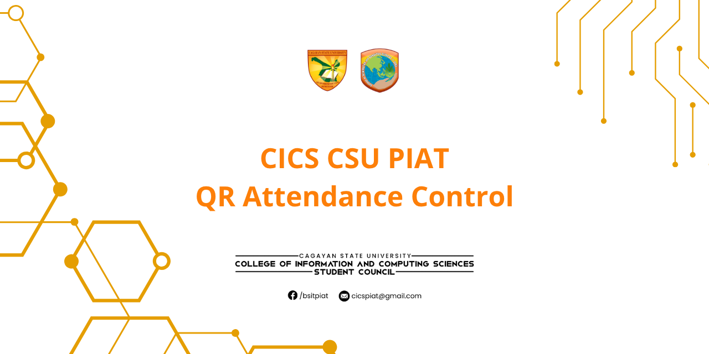
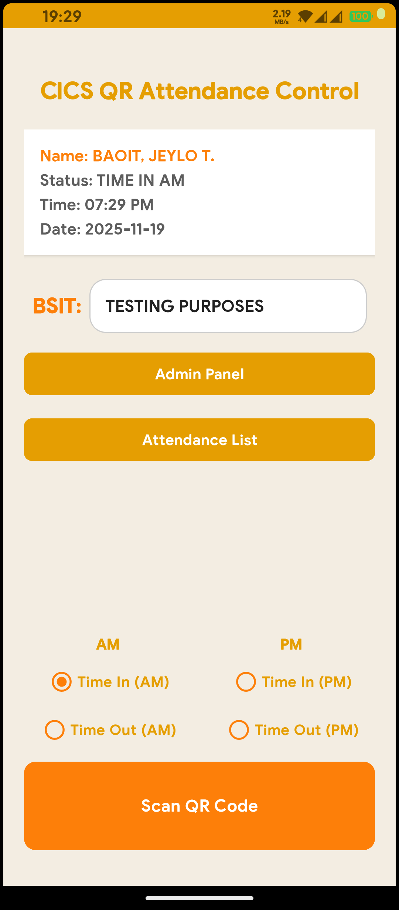
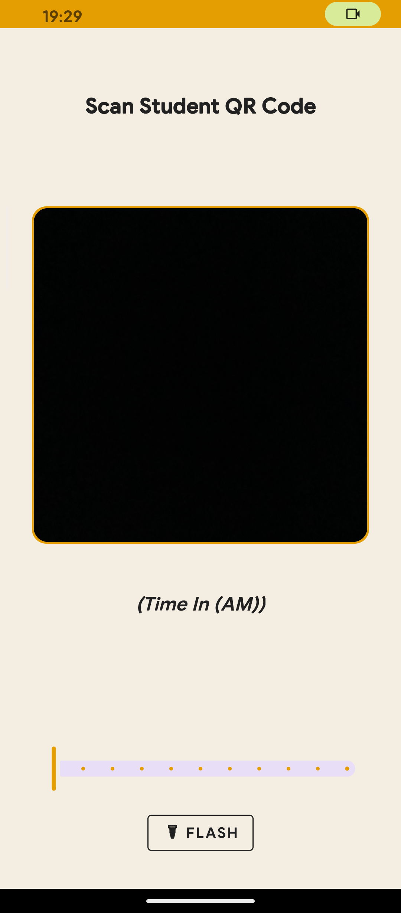
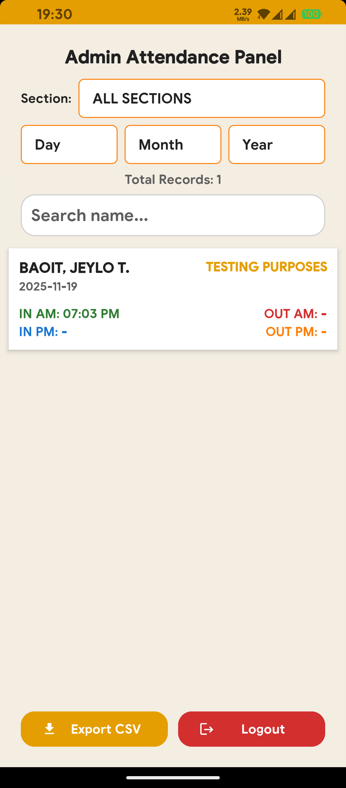
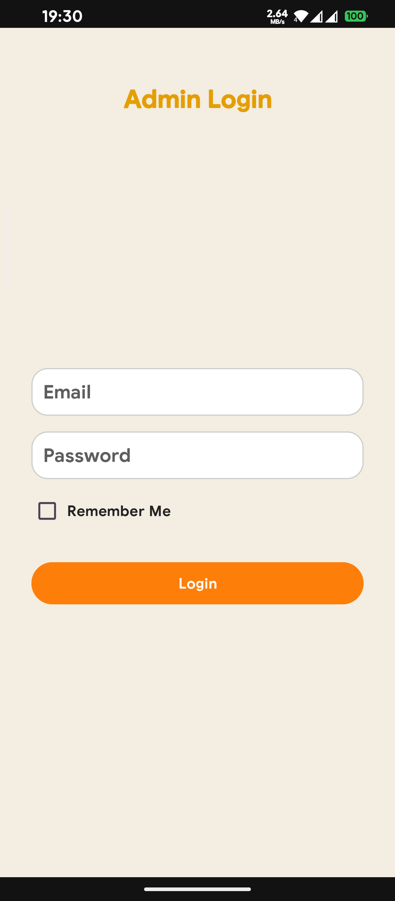

  

<h1 align="center">E-SIM Attendance Control</h1>

  A smart Android application for attendance control using QR codes, e-SIM integration, real-time analytics, and cloud synchronization.

  
  

---

## 🚀 New in V5.1 (Complete Overhaul)

- **⚡ Ultra-Fast Scanning:** Replaced legacy ZXing with **CameraX + ML Kit** for instant QR detection.
- **☁️ Dynamic Configuration:** Sections and Admin access can be updated instantly via **Firebase Remote Config** without an app update.
- **📊 Data Analytics:** Built-in charts to visualize attendance trends per year level.
- **🔔 Cloud Messaging:** Receive admin announcements via Push Notifications.

---

## ✨ Core Features

### 📱 For Attendance Taking
- **Smart Logic:** Automatically detects scanning errors (e.g., scanning "Time In" twice).
- **Offline-First:** Records are saved to a local SQLite database immediately, ensuring no data loss without internet.
- **Dynamic Sections:** Section lists ("1A", "1B", etc.) are fetched from the cloud.
- **History Log:** View, search, and manage local scan logs.
- **CSV Export:** Generate and share attendance reports compatible with Excel/Sheets.

### 🔐 For Administrators
- **Secure Login:** Protected by Firebase Authentication + UID Whitelisting.
- **Real-Time Sync:** Automatically uploads local records to Firestore when online.
- **Cloud Control:** Change the list of sections or add new admins remotely.
- **Global Search:** Filter records by Date, Section, Name, or Student ID.

---

## 📖 How to Use

### 🧑‍🏫 For Users (Faculty/Attendance Officers)
1.  **Select Section:** Choose the class section from the dropdown (loaded dynamically).
2.  **Select Time Slot:** Tap the radio button for **Time In (AM/PM)** or **Time Out (AM/PM)**.
3.  **Scan:** Tap **"Scan QR Code"** and point the camera at the student's ID.
    * *QR Format:* `ID_NUMBER|STUDENT_NAME`
4.  **View History:** Tap **"Attendance History"** to view logs.
    * *Green Dot:* Synced to cloud.
    * *Red Dot:* Local only (will sync when internet returns).
5.  **Export:** Go to History -> Tap **"Export CSV"** to save or share the report.

### 🛡️ For Admins
1.  **Login:** Tap **"Admin Panel"** on the main screen and log in with your credentials.
2.  **Dashboard:** View all attendance records synced from all devices.
3.  **Filter & Search:** Use the spinners to filter by Year/Month/Section or search a specific Name.
4.  **Manage Data:** Long-press a record to **Delete** it permanently from the cloud database.
5.  **Configuration:**
    * To add a new section (e.g., "5A"), simply update the `sections_list` JSON in **Firebase Remote Config**.
    * Restart the app to apply changes instantly.

---

## 🧰 Tech Stack

- **Language:** Java (Android SDK)
- **Architecture:** MVVM / Event-Driven
- **Scanning:** Android CameraX + Google ML Kit (Vision)
- **Database:** SQLite (Local) + Firebase Firestore (Cloud)
- **Backend/Config:** Firebase Remote Config, Authentication, Cloud Messaging (FCM)
- **Visualization:** MPAndroidChart
- **Export:** Storage Access Framework (SAF) & FileProvider

---

## 📦 APK Download

Click below to grab the latest version:

👉 [**Download APK**](https://example.com/download)

---

## 🖼 Screenshots

| Main Menu                        | Scanner Interface                |
|----------------------------------|----------------------------------|
|         |           |
| **Admin Panel**                  | **History Panel**                |
|      |        |
| **Login Interface**              | **Analytics Graph**              |
|  |  |

---

## 📧 Contact

For bugs, questions, or feedback, please open an issue on GitHub.

---

## 📝 License

This project is intended for academic and educational use.  
Please ask permission if you plan to use this in commercial or institutional settings.

---

## 🙌 Contributions

Pull requests and suggestions are welcome!  
Help improve the system by opening an issue or forking the project.